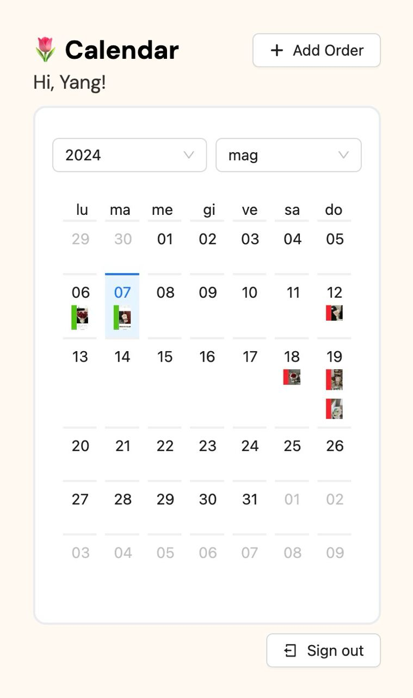
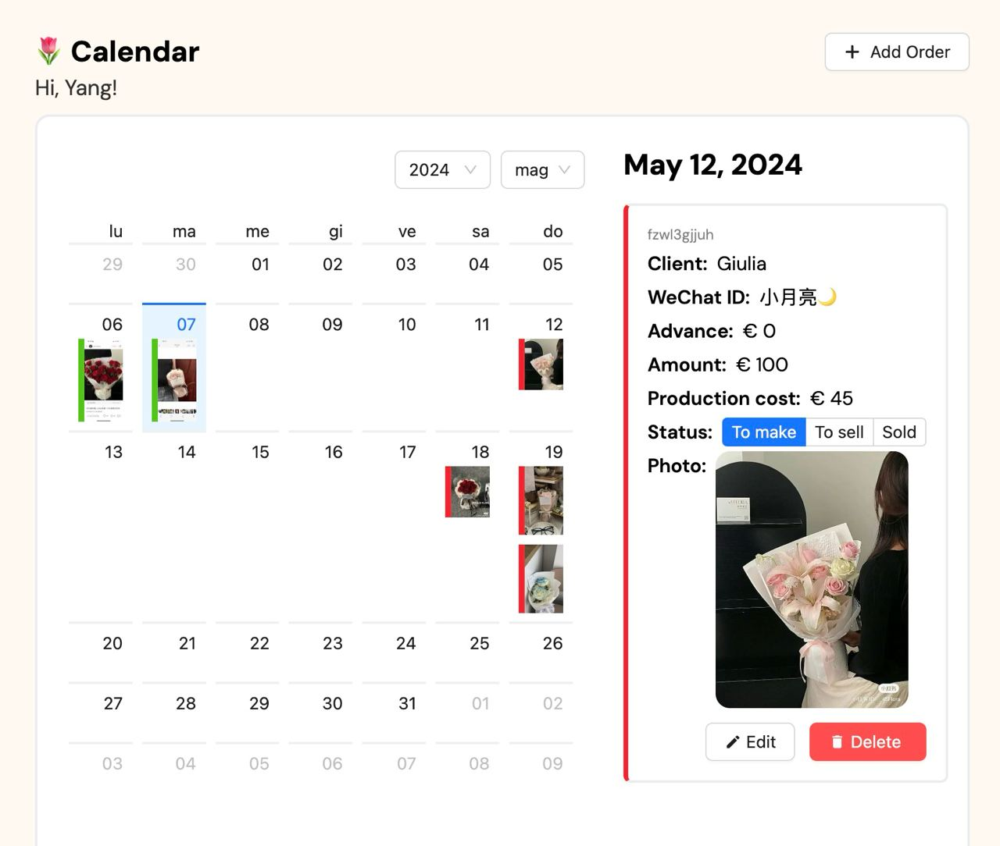
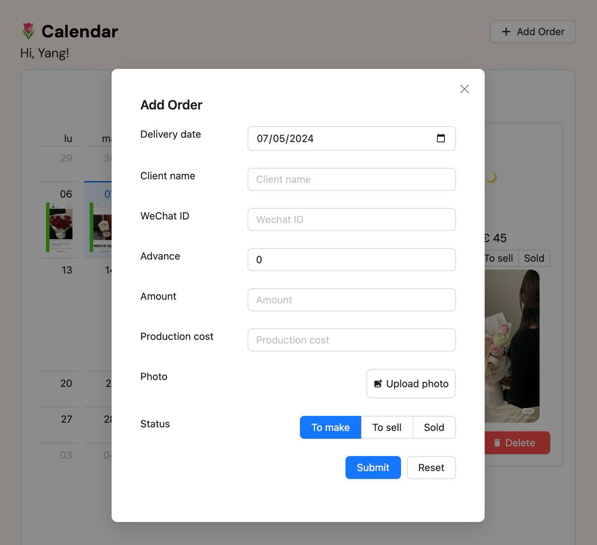

# 🌷 Flower Manager v1.1.0
### 👨🏻‍💻 By Yang (@yangxdev)

### 🌸 Description
Welcome to my latest project! This is an order manager I made for my partner's flower business where she can keep track of her orders and customers throughout the month. The project has been initially forked from my other recent project Budget Buddy, a budget manager I made for myself.

---

### 🌼 Screenshots




---

### 💐 Features
- Add, edit and delete orders
- Set status of each order (to make, to sell, sold)
- Login authentication with Google and GitHub 
- Image upload for each order
- Responsive design for mobile, tablet, and desktop
- Database backup and restore functionality

---

### 🌹 Technologies
- React (Next.js 14)
- Tailwind CSS
- AWS S3 (for image storage)
- PostgreSQL (w/ Prisma ORM)
- Vercel (for deployment)

---

### 🌺 Future Features
- Dark mode
- Add order from selected day
- Customer management
- Order search
- Order sorting
- Order statistics

---

### 🌱 Installation

To get this project up and running on your local machine, follow these steps:

1. **Clone the Repository:**
   ```
   git clone https://github.com/yangxdev/nextjs-flower-manager.git
   ```
2. **Navigate to the Project Folder:**
   ```
   cd nextjs-flower-manager
   ```
3. **Install Dependencies:**
   Use npm to install the required dependencies.
   ```
   npm install
   ```
   If you prefer using yarn:
   ```
   yarn install
   ```
4. **Start the Development Server:**
   Run the development server to view the project in your browser.
   ```
   npm run dev
   ```
   or with yarn:
   ```
   yarn dev
   ```
5. **Open in Your Browser:**
   Once the development server is running, open your browser and go to http://localhost:3000 to see the project in action.
   Now you have the project set up locally, and you can explore it, make modifications, and test it in your development environment.

---

### 🍃 Deployment
This project is currently deployed on Vercel for personal use. If you wish to deploy a similar project, follow these steps:

#### Prerequisites:

- **Vercel Account**: Ensure you have an account on [Vercel](https://vercel.com). If not, sign up for a free account.

- **Next-Auth**: This project uses Next-Auth, a library for handling authentication in Next.js applications, please refer to their [documentation](https://next-auth.js.org/deployment) for the deployment on Vercel

#### Deployment Steps:

1. **Connect Repository:**
   - Log in to your Vercel account.
   - Navigate to the dashboard and click on "Import Project."
   - Select the repository where your project is hosted.
2. **Configure Settings:**
   - Choose the branch you want to deploy (e.g., main or master).
   - Set the build command to match your project setup (e.g., npm run build).
3. **Environment Variables:**
   - If your project requires environment variables, configure them in the Vercel dashboard under the project settings.
4. **PostgreSQL Setup:**
   - My project uses a PostgreSQL database, but you can use whatever database suits you.
      - Refer to Vercel's [documentation](https://vercel.com/docs/storage/vercel-postgres/quickstart) on how to get started with Vercel's Postgres
   - Once your server is set up, you'll need to add the connection string as an environment variable in Vercel.
   - The environment variable should be named `DATABASE_URL` and its value should be the connection string to your PostgreSQL server.
5. **Deploy:**
   - Click on the "Deploy" button to initiate the deployment process.

---
   
### 🌿 Contact

Feel free to reach out if you have any questions, suggestions, or just want to connect! You can contact me via:

- Email: yangxdev@gmail.com
- LinkedIn: [Yang Xiang](https://www.linkedin.com/in/yangxng/)
- Telegram: [yang.xng](https://t.me/yangxng)
- GitHub: [yangxdev](https://github.com/yangxdev)
- Personal Website: [yangxdev.com](https://www.yangxdev.com)

I'm open to collaboration, feedback, and discussions about software engineering, frontend development, or anything related to my projects.

Looking forward to hearing from you! ✨

 

---

### 💮 License

MIT License

Copyright (c) 2024 yangxdev

Permission is hereby granted, free of charge, to any person obtaining a copy
of this software and associated documentation files (the "Software"), to deal
in the Software without restriction, including without limitation the rights
to use, copy, modify, merge, publish, distribute, sublicense, and/or sell
copies of the Software, and to permit persons to whom the Software is
furnished to do so, subject to the following conditions:

The above copyright notice and this permission notice shall be included in all
copies or substantial portions of the Software.

THE SOFTWARE IS PROVIDED "AS IS", WITHOUT WARRANTY OF ANY KIND, EXPRESS OR
IMPLIED, INCLUDING BUT NOT LIMITED TO THE WARRANTIES OF MERCHANTABILITY,
FITNESS FOR A PARTICULAR PURPOSE AND NONINFRINGEMENT. IN NO EVENT SHALL THE
AUTHORS OR COPYRIGHT HOLDERS BE LIABLE FOR ANY CLAIM, DAMAGES OR OTHER
LIABILITY, WHETHER IN AN ACTION OF CONTRACT, TORT OR OTHERWISE, ARISING FROM,
OUT OF OR IN CONNECTION WITH THE SOFTWARE OR THE USE OR OTHER DEALINGS IN THE
SOFTWARE.
